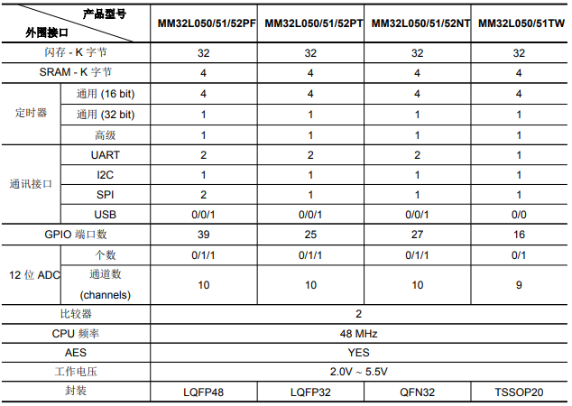

# [MM32L051](https://github.com/SoCXin/MM32L051)

#### [Vendor](https://github.com/SoCXin/Vendor)：[MindMotion](http://www.mm32.com.cn/)
#### [Core](https://github.com/SoCXin/Cortex)：[Cortex M0](https://github.com/SoCXin/CM0)
#### [Level](https://github.com/SoCXin/Level)：48MHz

## [描述](https://github.com/SoCXin/MM32L051/wiki)

[MM32L051](https://github.com/SoCXin/MM32L051)具有丰富的通信接口和功能，包括AES

### [资源收录](https://github.com/SoCXin/MM32L051)

* [文档](docs/)
* [资源](src/)

### [选型建议](https://github.com/SoCXin)

[MM32L051](https://github.com/SoCXin/MM32L051)

###  [SoC芯平台](http://www.SoC.Xin)
